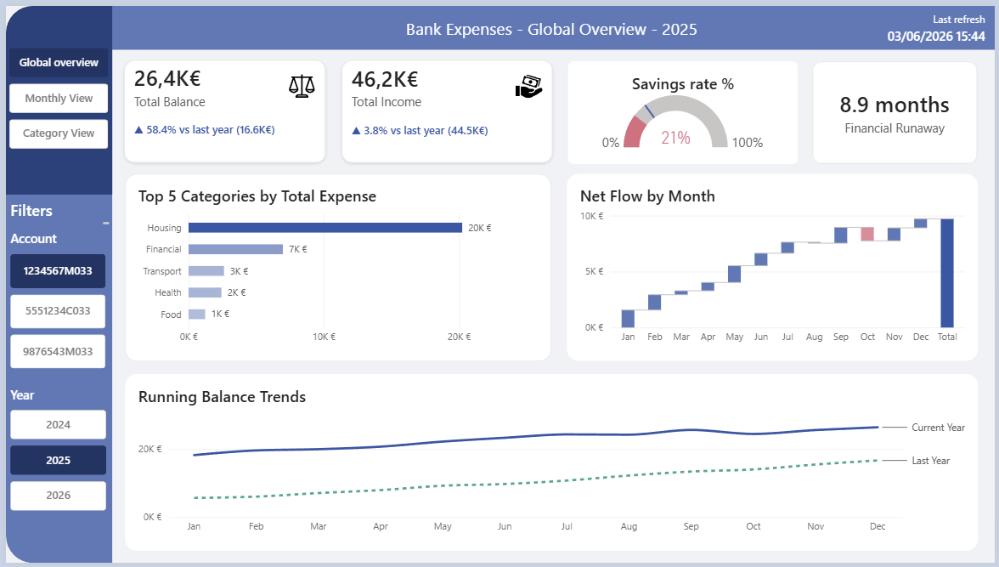

# Bank Expense Analyzer

> ⚠️ WORK IN PROGRESS: project under active development
> A comprehensive personal finance management system that automates expense categorization, consolidates multiple bank accounts, and provides actionable spending insights through interactive visualizations.

---

## 📋 Table of Contents

- [Overview](#overview)
- [STAR: Project Context](#star-project-context)
- [Key Features](#key-features)
- [Technology Stack](#technology-stack)
- [Project Structure](#project-structure)
- [Getting Started](#getting-started)
- [Usage](#usage)
- [Configuration](#configuration)
- [Data Pipeline](#data-pipeline)
- [License](#license)

---

## 🎯 Overview

Bank Expense Analyzer is a Python-based financial management system designed to help users gain control over their spending habits. By integrating data from multiple bank accounts, automatically categorizing transactions, and providing visual analytics, the system enables informed financial decision-making.


**Perfect for:**
- Tracking expenses across multiple bank accounts
- Understanding spending patterns by category
- Automating transaction categorization with customizable rules
- Building a unified personal finance experience with an interactive Power BI report
- Supporting La Banque Postale CSV exports through a dedicated processing pipeline

---

## 🎬 STAR: Project Context

### **Situation**
Managing personal finances across multiple bank accounts can be overwhelming. Bank statements arrive in different formats, transaction descriptions are inconsistent, and manually categorizing hundreds of transactions is time-consuming and error-prone. Users lack a centralized view of their spending patterns across all accounts.

### **Tasks**
The project required developing an automated solution to:
1. **Consolidate** transactions from multiple bank accounts into a unified database
2. **Normalize** data across different bank export formats
3. **Intelligently categorize** transactions using configurable rule-based matching
4. **Prevent duplicates** when importing new statements
5. **Provide visualization** of spending patterns and trends
6. **Enable manual adjustments** to automatically-assigned categories

### **Actions**
✅ **Data Ingestion Pipeline**: Built a robust data loading system that reads CSV files from multiple banks, handling various formats and column naming conventions

✅ **Data Cleaning Module**: Implemented comprehensive data validation including:
   - Column standardization and renaming
   - Duplicate detection and removal
   - Date and amount format normalization
   - Empty column and row elimination

✅ **Intelligent Categorization Engine**: Developed a regex-based rule system that:
   - Matches transaction descriptions against customizable category patterns
   - Supports hierarchical categorization (Category → Subcategory)
   - Tracks manual vs. automatic categorizations
   - Allows rule versioning and updates

✅ **Interactive Power BI Report**: Created an interactive Power BI report to:
   - Visualize spending patterns and trends
   - Edit and manage transaction categories
   - Export processed data for further analysis

✅ **Configuration Management**: Designed a YAML-based configuration system for:
   - File paths and data sources
   - Column mappings for different bank formats
   - Category rules and patterns
   - Output specifications

### **Results**
📊 **Operational Efficiency**:
   - Reduced manual data processing time by automating imports
   - Eliminated duplicate entry issues through intelligent deduplication
   - Enabled 90%+ automatic categorization accuracy with rule refinement

📈 **Financial Insights**:
   - Consolidated view of spending across all bank accounts
   - Clear identification of major expense categories
   - Ability to track spending trends over time
   - Foundation for budgeting and financial forecasting

🛠️ **System Quality**:
   - Modular architecture for easy maintenance and updates
   - Unit tests ensuring data integrity
   - Configuration-driven approach for flexibility
   - Incrementally updatable database preventing data loss

---

## ✨ Key Features

| Feature | Description |
|---------|-------------|
| **Multi-Account Integration** | Import and consolidate transactions from multiple bank accounts |
| **Automatic Categorization** | Regex-based rule engine for intelligent transaction categorization |
| **Format Flexibility** | Handles various CSV formats from different banks |
| **Duplicate Prevention** | Automatic detection and prevention of duplicate entries |
| **Manual Corrections** | Interactive UI to adjust categories and manage rules |
| **Data Persistence** | Incremental updates preserving historical data |
| **Interactive Power BI report** | Visualize spending patterns and trends |
| **Configuration-Driven** | YAML-based settings for easy customization |
| **Data Validation** | Comprehensive cleaning and normalization pipeline |

---

## 🛠️ Technology Stack

### Core Technologies
- **Python 3.13**: Primary programming language
- **Pandas**: Data manipulation and analysis
- **NumPy**: Numerical computing

### Frontend
- **Streamlit 1.53.0**: Interactive web dashboard
- **Power BI Desktop (June 2026)**: Interactive reporting and analytics

### Configuration & Data
- **PyYAML**: YAML configuration file parsing
- **JSONSchema**: Data validation
- **JSON/CSV**: Data formats

### Visualization
- **Matplotlib**: Core plotting library
- **Seaborn**: Statistical data visualization

### Environment Management
- **Conda**: Package and environment management
- **Python 3.13**: Runtime environment

---

## 📁 Project Structure

```
├── src/                                  # Core application modules
│   ├── __init__.py
│   ├── run_pipeline.py                # Main ETL orchestration
│   ├── categorize.py                  # Transaction categorization engine
│   ├── clean.py                       # Data cleaning functions
│   ├── config_loader.py               # Configuration management
│   └── io_utils.py                    # File I/O utilities
│
├── app/                                  # User-facing applications
│   ├── streamlit/                     # Streamlit dashboard
│   │   ├── main.py                    # Dashboard entry point
│   │   └── edit_categories.py         # Category management interface
│   └── power bi/                      # Power BI integration
│       └── bank_expense_report.pbix   # Power BI report
│
├── config/                               # Configuration files
│   ├── config_example.yml             # Example configuration template
│   └── config_local.yml               # Local configuration (user-specific)
│
├── data/                                 # Data directory
│   ├── raw/                           # Raw bank export files
│   │   ├── example/
│   │   └── personal/
│   ├── processed/                     # Processed and cleaned data
│   │   ├── example/
│   │   └── personal/
│   └── reference/                     # Reference data (categories)
│       ├── example/
│       └── personal/
│
├── tests/                             # Unit tests
│   ├── __init__.py
│   └── test_pipeline.py
│
├── environment.yml                    # Conda environment specification
└── README.md                          # This file

```

---

## 🚀 Getting Started

### Prerequisites
- **Conda/Anaconda** installed on your system
- **Git** for version control
- Minimum **1GB free disk space** for data storage

### Installation

1. **Clone the repository**
   ```bash
   git clone <repository-url>
   cd Analyse_comptes_bancaires
   ```

2. **Create the Conda environment**
   ```bash
   conda env create -f environment.yml
   ```

3. **Activate the environment**
   ```bash
   conda activate bank_expense_analyzer
   ```

4. **Copy and customize the configuration**
   ```bash
   cp config/config_example.yml config/config_local.yml
   # Edit config_local.yml with your paths and settings
   ```

### Quick Start

**Run the data pipeline:**
```bash
python -m src.run_pipeline
```

**Launch the Streamlit app for manual adjustment:**
```bash
streamlit run app/streamlit/main.py
```

**Access the dashboard:**
- Open your browser to `http://localhost:8501`

---

## 📊 Usage

### Data Import Workflow

1. **Export your bank statements** as CSV files from your bank
2. **Place them** in the configured `data/raw/` directory
3. **Run the pipeline** to process new transactions
4. **Review** categorizations in the dashboard
5. **Manually adjust** categories as needed

### Configuration Setup

Edit `config/config_local.yml`:

```yaml
# Data paths
input_folder: "data/raw/personal"
output_final: "data/processed/personal/final_data.csv"

# Column mappings for your bank format
columns_mapping:
  date: "Date"
  amount: "Amount"
  description: "Description"

# File specifications
file_extensions: [".csv"]
merge_col: "Transaction_ID"

# Path to categorization rules
rules_file: "config/rules.json"
```

### Categorization Rules

Define rules in JSON format:

```json
{
  "Food & Dining": [
    "(?i)restaurant",
    "(?i)pizza|burger|cafe",
    "(?i)supermarket"
  ],
  "Transport": [
    "(?i)uber|taxi|gas",
    "(?i)parking"
  ]
}
```

---

## 🔄 Data Pipeline

The system follows a robust ETL (Extract, Transform, Load) process:

```
┌─────────────────────────────────────────────────────────────┐
│                    DATA PIPELINE FLOW                        │
├─────────────────────────────────────────────────────────────┤
│                                                               │
│  1. EXTRACT                                                  │
│     └─ Load CSV files from data/raw/                        │
│     └─ Read existing processed dataset (if exists)          │
│                                                               │
│  2. TRANSFORM                                               │
│     └─ Rename columns based on config mapping             │
│     └─ Convert date formats (day-first)                     │
│     └─ Normalize amounts (comma → dot)                     │
│     └─ Parse La Banque Postale CSV format and bank-specific mappings │
│     └─ Drop empty columns & duplicates                     │
│     └─ Parse configuration and rules                       │
│                                                               │
│  3. DEDUPLICATION                                           │
│     └─ Compare against existing dataset                     │
│     └─ Identify new transactions                            │
│     └─ Preserve historical data                             │
│                                                               │
│  4. CATEGORIZATION                                          │
│     └─ Apply regex-based category rules                     │
│     └─ Assign primary & secondary categories                │
│     └─ Flag for manual review if uncertain                 │
│                                                               │
│  5. LOAD                                                    │
│     └─ Merge with existing dataset                          │
│     └─ Save to data/processed/final_data.csv               │
│     └─ Maintain data integrity and backups                 │
│                                                               │
└─────────────────────────────────────────────────────────────┘
```

---

## ⚙️ Configuration

### Key Configuration Parameters

| Parameter | Purpose | Example |
|-----------|---------|---------|
| `input_folder` | Raw CSV import location | `data/raw/personal` |
| `output_final` | Processed output file | `data/processed/final_data.csv` |
| `file_extensions` | Import file types | `[".csv"]` |
| `columns_mapping` | Column name mapping | `{date: "Date", ...}` |
| `merge_col` | Unique transaction identifier | `"Transaction_ID"` |
| `rules_file` | Category rules location | `"config/rules.json"` |

### Environment Variables

Set in your `.bashrc`, `.zshrc`, or system environment:

```bash
# Optional: override config location
export BANK_ANALYZER_CONFIG="path/to/config.yml"

# Optional: enable debug logging
export BANK_ANALYZER_DEBUG="true"
```

---

## 📜 License

This project is released under the **MIT License**. See the [LICENSE](LICENSE) file for details.

---

## 🧪 Testing

Run the test suite:

```bash
pytest tests/
```

Run specific tests:

```bash
pytest tests/test_pipeline.py -v
```

---

## 🚦 Dependencies

### Python Packages
- `pandas`: Data manipulation
- `numpy`: Numerical operations
- `pyyaml`: Configuration parsing
- `jsonschema`: Validation
- `streamlit`: Web interface
- `matplotlib`: Visualization
- `seaborn`: Statistical plotting

---

## 📜 License

This project is provided as-is for personal financial management. All data remains private and local.

---

## 👤 Author

**Adeline Le Ray**  
*Data Analyst*

---

**Last Updated**: June 2026  
**Version**: 1.0.0
